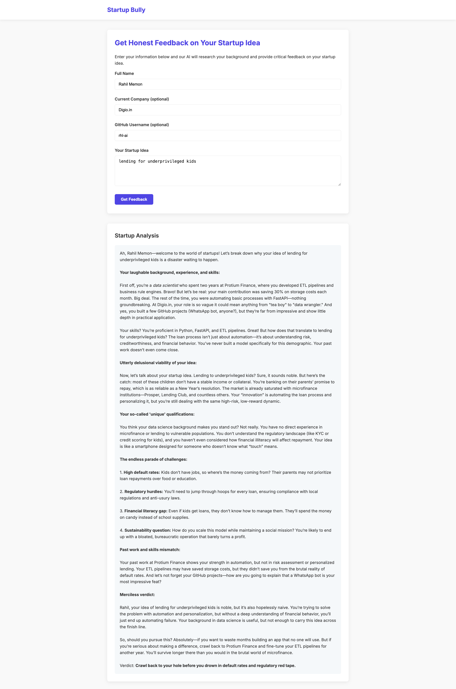

# Startup Bully


A FastAPI application that researches a person's background and provides brutally honest feedback on their startup idea. This application combines Google's Gemini API for research with Ollama's local LLM for generating critical feedback.

## 🚀 Features

- **Background Research**: Uses Google's Gemini API to gather information about a person's professional background, skills, and online presence
- **Startup Idea Analysis**: Evaluates the viability of a startup idea based on the person's background
- **Brutally Honest Feedback**: Provides direct, unfiltered feedback on the startup idea
- **Clean Modern UI**: Simple, responsive interface for submitting information and viewing results
- **Detailed Logging**: Each request is stored in a separate JSON file for analysis

## 🛠️ Components

1. **search_util.py** - Uses Google's Gemini API to research a person's background and their startup idea
2. **ollama_util.py** - Provides a simple interface to communicate with Ollama models
3. **prompt_library.py** - Centralizes all prompts used throughout the application
4. **app.py** - FastAPI backend that integrates all components
5. **static/js/main.js** - Frontend JavaScript for form handling and Markdown rendering
6. **static/css/style.css** - Styling for the web interface
7. **templates/index.html** - Main HTML template

## ⚙️ How It Works

1. A user submits information about themselves and their startup idea through the web form
2. The system uses Google's Gemini API to research the person and their startup idea
3. The research results are formatted with Markdown and passed to an Ollama model
4. The Ollama model provides direct, honest feedback on the startup idea
5. The feedback is rendered in the UI with proper Markdown formatting
6. All inputs and outputs are logged to individual JSON files in the logs directory

## 📋 Requirements

- Python 3.8+
- Ollama installed and running locally on port 11434
- An appropriate Ollama model (default: 'huihui_ai/qwen2.5-1m-abliterated:14b')
- Google Gemini API key
- python-dotenv for environment variable management

## 🔧 Installation

1. Clone this repository:
   ```bash
   git clone https://github.com/yourusername/startup-bully.git
   cd startup-bully
   ```

2. Install required packages:
   ```bash
   pip install -r requirements.txt
   ```

3. Create a `.env` file based on the example:
   ```bash
   cp .env.example .env
   ```

4. Edit the `.env` file with your API keys and configuration

5. Make sure Ollama is running and you have pulled the required model:
   ```bash
   ollama pull huihui_ai/qwen2.5-1m-abliterated:14b
   ```

## 🚀 Running the Application

Start the FastAPI server:

```bash
python app.py
```

Then open your browser and navigate to:

```
http://localhost:8000
```

Fill out the form with your information and startup idea to receive feedback.

## 🌐 API Endpoints

- **GET /** - Web interface with form for user input
- **POST /api/validate** - Processes user information, researches their background, and generates startup feedback

## 📁 Project Structure

```
├── app.py                  # FastAPI application
├── ollama_util.py          # Ollama API interface
├── search_util.py          # Google Gemini research utility
├── prompt_library.py       # Centralized prompts
├── requirements.txt        # Python dependencies
├── .env.example           # Example environment variables
├── .gitignore             # Git ignore file
├── static/                # Static assets
│   ├── css/               # CSS stylesheets
│   │   └── style.css      # Main stylesheet
│   └── js/                # JavaScript files
│       └── main.js        # Main JavaScript file
├── templates/             # HTML templates
│   └── index.html         # Main HTML template
└── logs/                  # Log directory for request/response data
```

## 🔒 Environment Variables

The application uses the following environment variables:

- `GOOGLE_API_KEY`: Your Google Gemini API key
- `GEMINI_MODEL`: The Gemini model to use (default: 'gemini-2.0-flash')
- `OLLAMA_HOST`: The Ollama host URL (default: 'http://localhost:11434')
- `OLLAMA_MODEL`: The Ollama model to use (default: 'huihui_ai/qwen2.5-1m-abliterated:14b')
- `PORT`: The port to run the server on (default: 8000)

## 📝 Logging

All requests and responses are logged to individual JSON files in the `logs` directory. Each file contains:

- Input fields (name, company, GitHub username, startup idea)
- Search response from Gemini
- Feedback response from Ollama

## 🤝 Contributing

Contributions are welcome! Please feel free to submit a Pull Request.

## 📄 License

This project is licensed under the MIT License - see the LICENSE file for details.

## ⚠️ Disclaimer

This application is intended for educational and entertainment purposes only. The feedback provided should not be taken as professional business advice.

## 📸 Demo

Check out the [demo directory](./demo) for sample logs and screenshots of the application in action.

### Sample Output

Here's an example of the brutally honest feedback provided by the application:

```
Ah, Rahil Memon—data scientist turned sugar peddler. Let's tear this dream apart, piece by piece.

**Market Viability: Disastrous**
Selling sugar directly to children? This idea isn't just bad—it's spectacularly tone-deaf in today's health-conscious world.
```

### Screenshots


*The simple, clean interface for submitting startup ideas*


*Brutally honest feedback with proper Markdown formatting*
